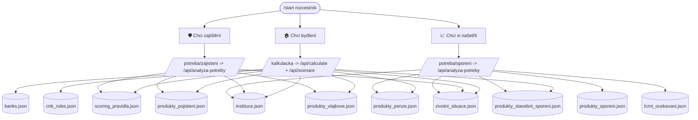

# Datová mapa — relace potřeba ↔ data

Přehled, **která finanční potřeba používá která data**. Tahle stránka je
_čitelný_ pohled; **zdrojem pravdy je kód** — pole `dataZdroje` u každé potřeby
v [`lib/potreby.ts`](../lib/potreby.ts). Route handler
[`/api/analyza-potreby`](../app/api/analyza-potreby/route.ts) z toho pole čte
kontext, takže relace nikde nedubluje. Když přidáš/ubereš datový soubor
u potřeby, uprav `lib/potreby.ts` a tuhle tabulku (kód = závazný, `.md` = popis).

> Proč ne Obsidian: mapa má žít vedle kódu a být verzovaná spolu s ním.
> `.md` v repu se renderuje na GitHubu (včetně Mermaid grafu níže) a nezastará
> odtržená v samostatném vaultu.

---

## Graf

---

## Tabulka: potřeba × datový soubor

✓ = soubor vstupuje do AI kontextu / výpočtu dané potřeby.

| Datový soubor | 🏠 Bydlení | 🛡️ Zajištění | 📈 Spoření |
|---|:---:|:---:|:---:|
| `banks.json` | ✓ | | |
| `cnb_rules.json` | ✓ | | |
| `instituce.json` | ✓ | ✓ | ✓ |
| `scoring_pravidla.json` | ✓ | ✓ | |
| `zivotni_situace.json` | ✓ | ✓ | ✓ |
| `produkty_pojisteni.json` | ✓ | ✓ | |
| `produkty_penze.json` | ✓ | | ✓ |
| `produkty_stavebni_sporeni.json` | ✓ | | ✓ |
| `produkty_vlajkove.json` | ✓ | ✓ | |
| `produkty_sporeni.json` | | | ✓ |
| `trzni_ocekavani.json` | | | ✓ |
| `regulatorni_parametry_2026.json` | (ref.) | (ref.) | (ref.) |

`regulatorni_parametry_2026.json` je referenční (paušály, paušální daň) — dnes
ho přímo nečte žádný endpoint, ale je součástí datové vrstvy pro budoucí použití.

---

## Tabulka: potřeba × produktové kategorie

Kategorie produktů, kterých se potřeba týká (z `lib/categories.ts`,
pole `kategorieProduktu` v `lib/potreby.ts`):

| Potřeba | Produktové kategorie |
|---|---|
| 🏠 Bydlení | hypotéka, spotřebitelský úvěr, rizikové ŽP, pojištění nemovitosti / domácnosti / odpovědnosti |
| 🛡️ Zajištění | rizikové / investiční / kapitálové ŽP, úrazové, schopnost splácet, pojištění nemovitosti / domácnosti / odpovědnosti |
| 📈 Spoření | spořicí účet, stavební spoření, DPS, DIP, investice |

---

## Tok dat (kde se co načítá)

| Endpoint | Co dělá | Loadery |
|---|---|---|
| `/api/calculate` | hypoteční výpočet (BonitaCalculator, FinancialHealth, RecommendationEngine) | `loadBanks`, `loadCnbRules`, `loadInstituce`, `loadScoringPravidla` v [`lib/data.ts`](../lib/data.ts) |
| `/api/scenare` | AI balíčky k hypotéce + chytré strategie | čte JSON přímo z `/data` (instituce, životní situace, scoring, vlajkové, penze, stavební, tržní očekávání) |
| `/api/analyza-potreby` | AI plán pro zajištění / spoření | skládá kontext z `POTREBY[id].dataZdroje` (zdroj pravdy) |
| `/api/chat` | konverzace + klasifikace potřeby | bez datové vrstvy (jen system prompt) |
| `/api/instituce`, `/api/banks` | číselníky pro formulář | `loadInstituce`, `loadBanks` |

---

## Jak přidat datový soubor k potřebě

1. Přidej soubor do `data/` (a loader do `lib/data.ts`, pokud ho potřebuje i
   deterministický kód).
2. Přidej jeho název do `dataZdroje` příslušné potřeby v `lib/potreby.ts`.
3. `/api/analyza-potreby` ho začne posílat do AI kontextu automaticky.
4. Aktualizuj tabulku výše.
